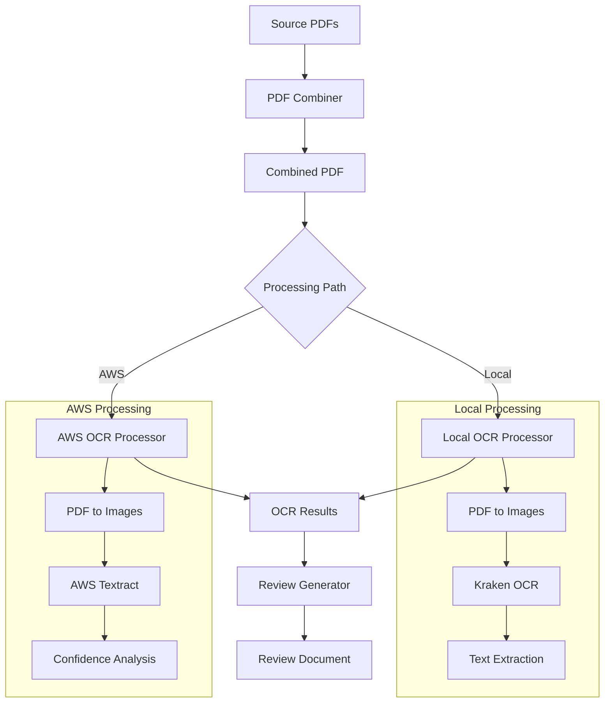

# Design Document

## Overview

The PDF OCR Processor is a multi-path document processing system that combines individual scanned PDF files and extracts text using either local (Kraken) or cloud-based (AWS Textract) OCR engines. The system generates human-reviewable documents that display original images alongside extracted text for validation and correction.

The system follows a pipeline architecture with four main processing stages:
1. **PDF Combination**: Merge individual scanned PDFs into a single document
2. **OCR Processing**: Extract text using either local Kraken or AWS Textract
3. **Review Generation**: Create side-by-side comparison documents
4. **Quality Assurance**: Provide confidence scoring and error reporting

## Architecture



## Components and Interfaces

### PDF Combiner Component

**Purpose**: Merge multiple individual PDF files into a single document while preserving order and quality.

**Implementation**: PowerShell script using PSWritePDF module
- **Input**: Directory containing SCN_*.pdf files
- **Output**: Single combined PDF file
- **Key Features**:
  - Numerical sorting of input files (SCN_0000.pdf, SCN_0001.pdf, etc.)
  - User confirmation of file order before processing
  - Dry-run mode for validation
  - File size and location reporting

**Interface**:
```powershell
Combine-RecipePDFs -InputFolder <path> -OutputFile <filename> [-DryRun]
```

### Local OCR Processor Component

**Purpose**: Extract text from PDF pages using Kraken OCR optimized for handwritten text.

**Implementation**: Python class `KrakenProcessorPythonOnly`
- **Dependencies**: PyMuPDF, PIL, Kraken OCR engine
- **Models**: 
  - Segmentation: `blla.mlmodel`
  - Recognition: `McCATMuS_nfd_nofix_V1.mlmodel`

**Processing Pipeline**:
1. **PDF Extraction**: Use PyMuPDF to extract pages at 300 DPI
2. **Image Processing**: Convert pages to PNG format for Kraken
3. **OCR Execution**: Run Kraken with exact command structure:
   ```bash
   kraken -i <imagefilename> <textoutputfilename> segment -bl -i blla.mlmodel ocr -m McCATMuS_nfd_nofix_V1.mlmodel
   ```
4. **Result Aggregation**: Combine individual page results into summary files

**Interface**:
```python
class KrakenProcessorPythonOnly:
    def process_pdf_with_kraken(self, pdf_path: Path, output_dir: Path) -> bool
    def process_single_page(self, image_path: Path, output_dir: Path, page_num: int) -> Dict
```

### AWS OCR Processor Component

**Purpose**: Extract text from PDF pages using AWS Textract with handwriting detection.

**Implementation**: Python class `AWSTextractOCR`
- **Dependencies**: boto3, PyMuPDF, PIL
- **AWS Service**: Textract `detect_document_text` API

**Processing Pipeline**:
1. **PDF Extraction**: Use PyMuPDF to extract pages at 216 DPI (3x scaling)
2. **Image Optimization**: Convert to PNG format suitable for Textract
3. **OCR Execution**: Call Textract API with handwriting detection
4. **Confidence Analysis**: Extract confidence scores for words and lines
5. **Quality Flagging**: Identify low-confidence words (< 80%) for review

**Interface**:
```python
class AWSTextractOCR:
    def process_recipe_pdf(self, pdf_path: Path, output_dir: Path) -> Dict[str, Any]
    def extract_handwritten_text(self, image_bytes: bytes) -> Dict[str, Any]
```

### Review Generator Component

**Purpose**: Create Word documents with side-by-side comparison of original images and OCR text.

**Implementation**: Python class `KrakenSideBySideGenerator`
- **Dependencies**: python-docx
- **Output Format**: Microsoft Word (.docx) document

**Document Structure**:
1. **Header**: Processing metadata and instructions
2. **Page Sections**: Two-column table layout
   - Left column: Original page image (3.8" width)
   - Right column: OCR text (Calibri 10pt font)
3. **Footer**: Summary of failed pages and errors

**Interface**:
```python
class KrakenSideBySideGenerator:
    def create_review_document(self, output_path: str = None) -> Path
    def load_kraken_results(self) -> Dict[str, Any]
```

## Data Models

### Processing Result Model
```python
{
    'pdf_name': str,
    'total_pages': int,
    'successful_pages': int,
    'failed_pages': int,
    'segmentation_model': str,  # Local only
    'recognition_model': str,   # Local only
    'pages': [PageResult]
}
```

### Page Result Model
```python
{
    'page_number': int,
    'image_file': str,
    'text_file': str,
    'text': str,
    'success': bool,
    'confidence': float,        # AWS only
    'word_count': int,          # AWS only
    'error': str               # If success = false
}
```

### OCR Text Model (AWS)
```python
{
    'text': str,
    'confidence': float,
    'lines': [LineResult],
    'words': [WordResult],
    'error': str              # Optional
}
```

### Line/Word Result Model (AWS)
```python
{
    'text': str,
    'confidence': float
}
```

## Correctness Properties

*A property is a characteristic or behavior that should hold true across all valid executions of a system-essentially, a formal statement about what the system should do. Properties serve as the bridge between human-readable specifications and machine-verifiable correctness guarantees.*

### Property 1: PDF Combination Preserves Order and Completeness
*For any* set of numerically named PDF files, combining them should result in a single PDF that contains all pages in the correct numerical order and preserves the original page count and content quality.
**Validates: Requirements 1.1, 1.2, 1.3**

### Property 2: OCR Processing Produces Complete Results
*For any* valid PDF input, OCR processing should extract text for each page and generate the expected output files (text files, summary JSON, and combined text file).
**Validates: Requirements 2.1, 2.3, 3.1, 3.3**

### Property 3: Error Handling Preserves System Stability
*For any* invalid input or processing failure, the system should continue processing remaining items, log detailed error information, and provide meaningful error messages without crashing.
**Validates: Requirements 1.4, 2.4, 3.5, 5.1, 5.2, 5.3**

### Property 4: Confidence Scoring Flags Low-Quality Results
*For any* OCR result with confidence scores below the configured threshold, those words should be flagged for manual review in both the text output and review document.
**Validates: Requirements 3.4, 4.3**

### Property 5: Review Document Generation Maintains Structure
*For any* set of OCR results, the generated review document should contain a two-column layout with original images on the left, OCR text on the right, and proper formatting for all successfully processed pages.
**Validates: Requirements 4.1, 4.2, 4.5, 8.1, 8.2**

### Property 6: Processing Models and APIs Are Used Correctly
*For any* processing path selected, the system should use the exact specified models (Kraken: blla.mlmodel + McCATMuS_nfd_nofix_V1.mlmodel) or APIs (AWS: detect_document_text) without deviation.
**Validates: Requirements 2.2, 3.2**

### Property 7: Configuration Options Control System Behavior
*For any* valid configuration setting (output directory, confidence threshold, processing path), the system should respect those settings and produce results accordingly.
**Validates: Requirements 6.1, 6.2, 6.3, 6.4**

### Property 8: Processing Resilience Preserves Partial Work
*For any* processing interruption or partial failure, completed work should be preserved and the system should allow resumption or selective reprocessing of failed items.
**Validates: Requirements 5.4, 7.4**

### Property 9: Image Resolution Meets OCR Requirements
*For any* PDF page extraction, the resulting images should meet the minimum resolution requirements (300 DPI for Kraken, 216 DPI for AWS Textract) for optimal OCR accuracy.
**Validates: Requirements 7.1**

### Property 10: Summary Statistics Reflect Actual Results
*For any* processing run, the generated summary statistics (success rates, page counts, error counts) should accurately reflect the actual processing results.
**Validates: Requirements 2.5, 8.5**

## Error Handling

The system implements comprehensive error handling across all components:

### PDF Combination Errors
- **Missing Files**: Validate all source PDFs exist before processing
- **Corrupted Files**: Detect and report corrupted PDF files with specific error messages
- **Permission Issues**: Handle file access permissions gracefully
- **Disk Space**: Check available disk space before creating combined PDF

### OCR Processing Errors
- **Dependency Missing**: Check for Kraken installation and AWS credentials
- **Model Loading**: Validate Kraken models are available and accessible
- **API Failures**: Handle AWS Textract service errors with retry logic
- **Memory Issues**: Process pages sequentially to manage memory usage
- **Format Errors**: Validate image formats and quality before OCR processing

### Review Generation Errors
- **Missing Images**: Handle cases where page images are not found
- **Text Encoding**: Handle various text encodings in OCR results
- **Document Creation**: Validate Word document creation and formatting
- **File Permissions**: Handle output file permission issues

### Recovery Mechanisms
- **Partial Processing**: Preserve completed work when processing is interrupted
- **Selective Retry**: Allow reprocessing of only failed pages
- **Progress Tracking**: Maintain processing state for resumption
- **Rollback**: Provide options to revert to previous processing state

## Testing Strategy

The system requires comprehensive testing using both unit tests and property-based tests to ensure correctness across all processing paths.

### Unit Testing Approach
Unit tests focus on specific examples, edge cases, and integration points:

- **PDF Combination**: Test with known file sets and verify correct ordering
- **OCR Processing**: Test with sample images and verify text extraction
- **Error Conditions**: Test with invalid inputs and verify error handling
- **Configuration**: Test various configuration combinations
- **File I/O**: Test file reading, writing, and permission scenarios

### Property-Based Testing Approach
Property tests verify universal properties across randomized inputs:

- **File Ordering**: Generate random filename sets and verify sorting correctness
- **OCR Completeness**: Generate various PDF inputs and verify complete processing
- **Error Resilience**: Inject random failures and verify system stability
- **Configuration Validation**: Test random configuration combinations
- **Output Consistency**: Verify output format consistency across different inputs

### Testing Configuration
- **Minimum 100 iterations** per property test to ensure comprehensive coverage
- **Test Framework**: pytest for Python components, Pester for PowerShell components
- **Property Testing Library**: Hypothesis for Python property-based tests
- **Mock Services**: Mock AWS Textract for testing without incurring costs
- **Test Data**: Use synthetic PDFs and known OCR samples for reproducible testing

### Test Tagging
Each property test must reference its design document property:
- **Feature: pdf-ocr-processor, Property 1**: PDF Combination Preserves Order and Completeness
- **Feature: pdf-ocr-processor, Property 2**: OCR Processing Produces Complete Results
- **Feature: pdf-ocr-processor, Property 3**: Error Handling Preserves System Stability
- And so on for all properties...

### Integration Testing
- **End-to-End Workflows**: Test complete processing pipelines from PDF input to review document output
- **Cross-Platform Testing**: Verify functionality on Windows with WSL integration
- **Performance Testing**: Validate processing times and memory usage with large documents
- **AWS Integration**: Test actual AWS Textract integration with proper credentials and error handling