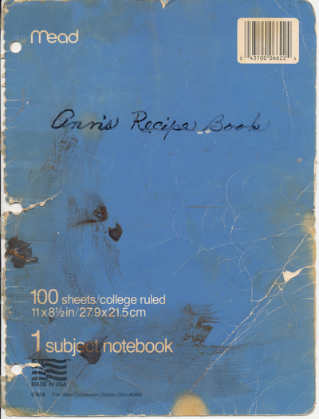
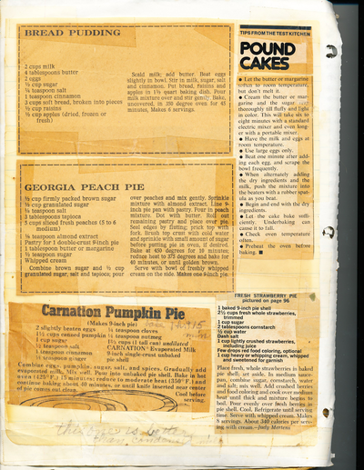
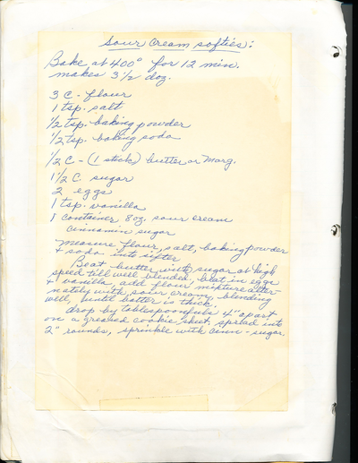

# PDF OCR Processor

**Version 1.0.0** | [Changelog](CHANGELOG.md) | [Releases](../../releases)

A document processing system that combines individual scanned PDF files and extracts text using either local (Kraken OCR) or cloud-based (AWS Textract) OCR engines. The system generates human-reviewable documents that display original images alongside extracted text for validation and correction.

The drive for this project was that my father-in-law had gotten his mother's old spiral bound recipe notebook. This contained a number of clipped and handwritten recipes taped into the pages. I wanted to accomplish 2 things, first was to scan in the pages and create a single PDF with all the pages and second was to create OCR'd text that could be updated from the recipes to make it easier to transcribe those recipes elsewhere. 

Example of the pages that I scanned:

- 
- 
- 
 
For me creating the scanned files was fastest done by plugging a usb stick into my Canon printer/scanner and scanning the pages and writing to the usb stick. There I transfered the files to a folder to combine the images into a PDF. From there I wanted to play with different ways to OCR the text and have a way to easily compare the scan with the text from that scan.

I initially went to use Tesaract for the OCR. However, it cannot handle cursive, or handwriting. So I had to switch to Kraken which had modules for analysing handwriting. I also wanted to try out AWS Textract and compare the two results. 

I have released a v1 MVP product that will take scanned files, combine them to a single PDF and then process them through Kraken or AWS Textract and then produce a combined word document that provides a side by side comparision of the image file and its OCR text.
## 🎯 Features

- **PDF Combination**: Merge multiple individual PDF files into a single document with proper ordering
- **Dual OCR Processing**: Choose between local Kraken OCR or AWS Textract for handwritten text recognition
- **Review Documents**: Generate Word documents with side-by-side image and text comparison
- **Confidence Scoring**: AWS Textract provides confidence scores for quality assessment
- **Error Handling**: Robust error handling with detailed logging and recovery options
- **Windows-Platform Focus**: Works on Windows with WSL integration for local processing. Can be used on Linux or OSX assuming deployment of PowerShell to support the image combinor

## 📋 Prerequisites

### System Requirements
- **Windows 10/11** with PowerShell 7.5+
- **Python 3.10+** with pip
- **WSL (Windows Subsystem for Linux)** - for local Kraken OCR processing
- **AWS Account** - for cloud-based OCR processing (optional)

### Required Python Packages
```bash
pip install PyMuPDF Pillow python-docx boto3
```

### PowerShell Modules
```powershell
Install-Module PSWritePDF -Force
```

## 📚 Documentation

- **[README.md](README.md)** - Complete usage guide and reference (this file)
- **[SETUP_GUIDE.md](SETUP_GUIDE.md)** - Quick 5-minute setup instructions
- **[TROUBLESHOOTING.md](TROUBLESHOOTING.md)** - Common issues and solutions
- **[EXAMPLES.md](EXAMPLES.md)** - Real-world usage examples and workflows
- **[CHANGELOG.md](CHANGELOG.md)** - Version history and release notes
- **[config_template.py](config_template.py)** - Configuration template for customization

## 🔍 System Information

Check your system setup and version:
```bash
# Get version number only
python version_info.py --version

# Get complete system status
python version_info.py
```

## 🚀 Quick Start

### 1. PDF Combination
Combine individual scanned PDFs into a single document:

```powershell
# Navigate to your project directory
cd C:\path\to\recipe-processor

# Run the PDF combiner (dry-run first)
.\image_combinor\combine_recipe_pdfs.ps1 -InputFolder "C:\path\to\scanned\pdfs" -DryRun

# If order looks correct, run actual combination
.\image_combinor\combine_recipe_pdfs.ps1 -InputFolder "C:\path\to\scanned\pdfs"
```

### 2. OCR Processing

#### Option A: AWS Textract (Cloud-based)
```bash
# Configure AWS credentials first
aws configure

# Run AWS OCR processing
python aws_processor/kraken_alternative_aws.py
```

#### Option B: Kraken OCR (Local)
```bash
# In WSL environment with Kraken installed
python local_processor/process_recipes_kraken_python_only.py
```

### 3. Generate Review Document
```bash
# For Kraken results
python local_processor/kraken_sidebyside_generator.py

# For AWS Textract results  
python aws_processor/aws_textract_sidebyside_generator.py
```

## 📖 Detailed Usage Guide

### PDF Combination Workflow

The PDF combiner processes individual scanned files (SCN_0000.pdf, SCN_0001.pdf, etc.) and combines them into a single document.

**Input Requirements:**
- Individual PDF files named with pattern `SCN_*.pdf`
- Files should be in numerical order
- All files should be in the same directory

**Usage:**
```powershell
# Basic usage
.\image_combinor\combine_recipe_pdfs.ps1

# Custom input folder and output name
.\image_combinor\combine_recipe_pdfs.ps1 -InputFolder "C:\MyPDFs" -OutputFile "MyDocument.pdf"

# Dry run to verify order without combining
.\image_combinor\combine_recipe_pdfs.ps1 -DryRun
```

**Output:**
- Single combined PDF file
- File size and location information
- Processing summary

### AWS Textract OCR Workflow

AWS Textract provides cloud-based OCR with handwriting detection and confidence scoring.

**Setup:**
1. **Install AWS CLI:**
   ```bash
   # Download from: https://aws.amazon.com/cli/
   aws --version
   ```

2. **Configure AWS Credentials:**
   ```bash
   aws configure
   # Enter: Access Key ID, Secret Access Key, Region (us-east-1), Output format (json)
   ```

3. **Verify Access:**
   ```bash
   aws sts get-caller-identity
   ```

**Usage:**
```python
# Edit paths in aws_processor/kraken_alternative_aws.py
pdf_path = Path(r"C:\path\to\your\Combined_PDF.pdf")
output_dir = Path(r"C:\path\to\output\directory")

# Run processing
python aws_processor/kraken_alternative_aws.py
```

**Output Files:**
- `page_001_ocr.txt`, `page_002_ocr.txt`, etc. - Individual page text files
- `{PDF_name}_summary.json` - Processing summary with confidence scores
- Low-confidence words flagged for review

**Configuration Options:**
- **Region**: Default `us-east-1`, change in script if needed
- **Confidence Threshold**: Default 80%, words below this are flagged
- **Image Resolution**: 216 DPI (3x scaling) for optimal recognition

### Kraken OCR Workflow (Local Processing)

Kraken OCR provides local handwriting recognition optimized for historical documents.

**Setup:**
1. **Install WSL:**
   ```powershell
   # In PowerShell as Administrator
   wsl --install
   # Restart computer when prompted
   ```

2. **Install Kraken in WSL:**
   ```bash
   # In WSL terminal
   sudo apt update
   sudo apt install python3-pip
   pip3 install kraken
   
   # Download models (adjust paths as needed)
   kraken get 10.5281/zenodo.2577813  # blla.mlmodel
   kraken get 10.5281/zenodo.4274889  # McCATMuS_nfd_nofix_V1.mlmodel
   ```

3. **Verify Installation:**
   ```bash
   kraken --help
   ls ~/.kraken/  # Check models are downloaded
   ```

**Usage:**
```python
# Edit paths in local_processor/process_recipes_kraken_python_only.py
wsl_pdf_path = "/mnt/c/path/to/your/Combined_PDF.pdf"
wsl_output_dir = "/mnt/c/path/to/output/directory"

# Run processing (in WSL)
python3 local_processor/process_recipes_kraken_python_only.py
```

**Output Files:**
- `page_001_text.txt`, `page_002_text.txt`, etc. - Individual page text files
- `page_images/page-001.png`, etc. - Extracted page images (300 DPI)
- `all_pages_combined.txt` - All text in one file
- `processing_results.json` - Processing summary

**Model Configuration:**
- **Segmentation Model**: `blla.mlmodel` (baseline layout analysis)
- **Recognition Model**: `McCATMuS_nfd_nofix_V1.mlmodel` (handwriting optimized)
- **Command Structure**: `kraken -i <image> <output> segment -bl -i blla.mlmodel ocr -m McCATMuS_nfd_nofix_V1.mlmodel`

### Review Document Generation

Generate Word documents with side-by-side comparison of original images and OCR text.

#### For Kraken Results:
```python
# Edit path in local_processor/kraken_sidebyside_generator.py
kraken_output_dir = r"C:\path\to\kraken_output"

# Run generator
python local_processor/kraken_sidebyside_generator.py
```

#### For AWS Textract Results:
```python
# Edit path in aws_processor/aws_textract_sidebyside_generator.py  
aws_output_dir = r"C:\path\to\aws_textract_output"

# Run generator
python aws_processor/aws_textract_sidebyside_generator.py
```

**Output:**
- Word document (.docx) with two-column layout
- Left column: Original page images
- Right column: OCR text (editable)
- Processing metadata and statistics
- Summary of failed pages (if any)

**Document Features:**
- **Editable Text**: Correct OCR errors directly in Word
- **Image Quality**: High-resolution images for comparison
- **Confidence Highlighting**: Low-confidence words highlighted (AWS only)
- **Processing Stats**: Success rates, model information, page counts

## ⚙️ Configuration Options

### File Paths
All scripts use hardcoded paths that should be updated for your environment:

**PDF Combiner:**
```powershell
# In image_combinor/combine_recipe_pdfs.ps1
$InputFolder = "C:\your\path\to\scanned\pdfs"
$OutputFile = "Your_Combined_Document.pdf"
```

**AWS Processor:**
```python
# In aws_processor/kraken_alternative_aws.py
pdf_path = Path(r"C:\your\path\to\Combined_PDF.pdf")
output_dir = Path(r"C:\your\path\to\aws_output")
```

**Kraken Processor:**
```python
# In local_processor/process_recipes_kraken_python_only.py
wsl_pdf_path = "/mnt/c/your/path/to/Combined_PDF.pdf"
wsl_output_dir = "/mnt/c/your/path/to/kraken_output"
```

### OCR Settings

**AWS Textract:**
- **Region**: `us-east-1` (change in `AWSTextractOCR.__init__()`)
- **Confidence Threshold**: 80% (change in `extract_handwritten_text()`)
- **Image Resolution**: 216 DPI (change `Matrix(3, 3)` in `pdf_to_images()`)

**Kraken OCR:**
- **Image Resolution**: 300 DPI (change `Matrix(300/72, 300/72)` in `extract_pdf_pages_python()`)
- **Models**: Update model names in `KrakenProcessorPythonOnly.__init__()`
- **Command Options**: Modify `ocr_cmd` in `process_single_page()`

## 🔧 Troubleshooting

### Common Issues

#### PDF Combination Issues

**Error: "PSWritePDF module not found"**
```powershell
# Install the module
Install-Module PSWritePDF -Force -AllowClobber

# If still failing, try:
Import-Module PSWritePDF -Force
```

**Error: "No SCN_*.pdf files found"**
- Verify files are named correctly (SCN_0000.pdf, SCN_0001.pdf, etc.)
- Check the input folder path is correct
- Ensure files are not corrupted

**Error: "Access denied" or permission issues**
- Run PowerShell as Administrator
- Check file permissions on input and output directories
- Ensure files are not open in another application

#### AWS Textract Issues

**Error: "AWS setup error" or credential issues**
```bash
# Reconfigure AWS credentials
aws configure

# Test access
aws sts get-caller-identity

# Check region settings
aws configure get region
```

**Error: "Textract error: InvalidParameterException"**
- Check image size limits (max 10MB per image)
- Verify image format is supported (PNG, JPEG)
- Ensure PDF is not corrupted

**Error: "Rate limit exceeded"**
- AWS Textract has rate limits (varies by region)
- Add delays between API calls if processing many pages
- Consider using asynchronous processing for large documents

#### Kraken OCR Issues

**Error: "Kraken not found"**
```bash
# In WSL, verify installation
which kraken
kraken --help

# If not installed:
pip3 install kraken
```

**Error: "Model not found"**
```bash
# Check available models
kraken list

# Download missing models
kraken get 10.5281/zenodo.2577813  # blla.mlmodel
kraken get 10.5281/zenodo.4274889  # McCATMuS_nfd_nofix_V1.mlmodel

# Verify model location
ls ~/.kraken/
```

**Error: "Permission denied" on WSL paths**
- Ensure WSL can access Windows files via `/mnt/c/`
- Check file permissions: `chmod 644 /mnt/c/path/to/file.pdf`
- Verify paths use forward slashes in WSL

#### Review Document Generation Issues

**Error: "Missing python-docx"**
```bash
pip install python-docx
```

**Error: "Image not found" in review document**
- Verify image paths in OCR output match actual file locations
- Check that page images were extracted successfully
- Ensure image files are not corrupted

**Error: "Document creation failed"**
- Check available disk space (Word documents can be large)
- Verify output directory exists and is writable
- Close any existing Word documents with the same name

### Performance Optimization

**Large Document Processing:**
- Process documents in smaller batches
- Monitor memory usage during processing
- Use SSD storage for faster I/O operations

**AWS Cost Optimization:**
- Use dry-run mode to verify setup before processing
- Monitor AWS billing for Textract usage
- Consider batch processing for multiple documents

**Kraken Performance:**
- Use high-resolution images (300 DPI) for better accuracy
- Ensure adequate RAM for large documents
- Consider using GPU acceleration if available

## 📁 Project Structure

```
recipe-processor/
├── aws_processor/
│   ├── kraken_alternative_aws.py          # AWS Textract OCR processor
│   └── aws_textract_sidebyside_generator.py  # AWS review document generator
├── image_combinor/
│   └── combine_recipe_pdfs.ps1            # PDF combination script
├── local_processor/
│   ├── process_recipes_kraken_python_only.py  # Kraken OCR processor
│   └── kraken_sidebyside_generator.py     # Kraken review document generator
├── test-data/
│   ├── SCN_0000.pdf ... SCN_0052.pdf     # Individual scanned PDFs
│   ├── Anns_Complete_Recipe_Book.pdf     # Combined PDF
│   ├── aws_textract_output/              # AWS processing results
│   └── kraken_output/                    # Kraken processing results
├── .kiro/
│   └── specs/pdf-ocr-processor/          # Project specifications
├── README.md                             # This documentation
└── .gitignore                           # Git ignore rules
```

## 🔄 Complete Workflow Example

Here's a complete example of processing a set of recipe PDFs:

### Step 1: Prepare Individual PDFs
```
# Ensure your scanned PDFs are named:
SCN_0000.pdf, SCN_0001.pdf, SCN_0002.pdf, ... SCN_0052.pdf
```

### Step 2: Combine PDFs
```powershell
# Test the combination order first
.\image_combinor\combine_recipe_pdfs.ps1 -InputFolder "C:\MyRecipes" -DryRun

# If order is correct, combine
.\image_combinor\combine_recipe_pdfs.ps1 -InputFolder "C:\MyRecipes" -OutputFile "My_Recipe_Book.pdf"
```

### Step 3: Choose OCR Method

#### Option A: AWS Textract (Recommended for handwriting)
```bash
# Configure AWS (one-time setup)
aws configure

# Edit paths in aws_processor/kraken_alternative_aws.py
# Run OCR processing
python aws_processor/kraken_alternative_aws.py

# Generate review document
python aws_processor/aws_textract_sidebyside_generator.py
```

#### Option B: Kraken OCR (Local processing)
```bash
# Setup WSL and Kraken (one-time setup)
# Edit paths in local_processor/process_recipes_kraken_python_only.py

# In WSL terminal:
python3 local_processor/process_recipes_kraken_python_only.py

# Generate review document (in Windows):
python local_processor/kraken_sidebyside_generator.py
```

### Step 4: Review and Edit
1. Open the generated Word document
2. Compare original images (left) with OCR text (right)
3. Edit OCR text directly in Word to correct any errors
4. Save the corrected document

## 🤝 Contributing

This project follows a specification-driven development approach. See `.kiro/specs/pdf-ocr-processor/` for detailed requirements, design, and implementation tasks.

### Development Workflow
1. Check current version: `python version_info.py --version`
2. Review [CHANGELOG.md](CHANGELOG.md) for recent changes
3. Follow the task list in `.kiro/specs/pdf-ocr-processor/tasks.md`
4. Update version and changelog for releases

### Versioning
This project uses [Semantic Versioning](https://semver.org/):
- **MAJOR.MINOR.PATCH** (e.g., 1.0.0)
- See [CHANGELOG.md](CHANGELOG.md) for version history and migration guides

## 📄 License

This project is for personal use. Ensure compliance with AWS service terms and Kraken OCR licensing when using in production environments.

---

**Need Help?** Check the troubleshooting section above or review the detailed specifications in `.kiro/specs/pdf-ocr-processor/`.